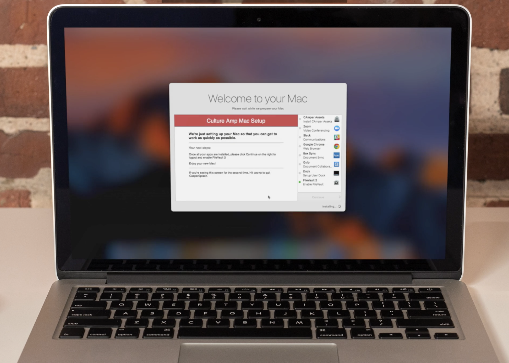

# SplashBuddy

SplashBuddy goal is to provide an *elegant* and *secure* onboarding process for Mac users using [DEP](https://www.apple.com/business/dep/). 

It allows you to:

- Prevent your users from using their Mac before the minimum software is installed
- Provide status on the software that is currently being installed
- Display important information

It currently supports Jamf Pro. You're welcome to [contribute](https://github.com/ftiff/SplashBuddy/blob/master/CONTRIBUTING.md) to the project. Every little helps.

## In action

Here's a video of the SplashBuddy running at Culture Amp that was presented during [Macbrained](http://smithjw.me/2017/03/24/Onboarding-talk-at-Macbrained/) (Click on the image).

## Quick Start

The best place to start is the [Onboarding Manual](https://github.com/ftiff/SplashBuddy/wiki/Onboarding-Manual).

## Release history

The release history is available [here](CHANGELOG.md).

Splashbuddy was made possible thanks to the work of [the following individuals](THANKS.md).

## Getting help 

The best place to discuss SplashBuddy is to join the `#splashbuddy` channel on the [MacAdmins Slack](https://macadmins.herokuapp.com).
